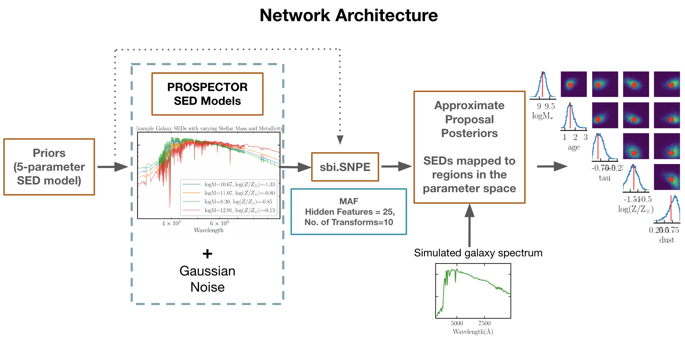

Repository for the project DIGS: Deep Inference of Galaxy Spectra with Neural Posterior Estimation and SBI. This contains scripts for training set generation, and NPE training. This project uses Prospector (Johnson et al. 2021) and Mackelab-sbi (Tejero Cantero et al. 2020).

Authors: Gourav Khullar, Brian Nord, Aleksandra Ciprijanovic, Jason Poh, Fei Xu

